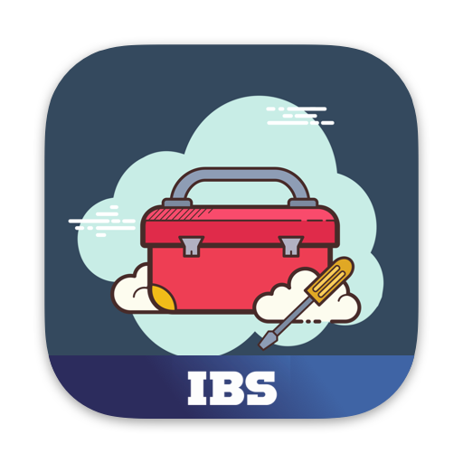
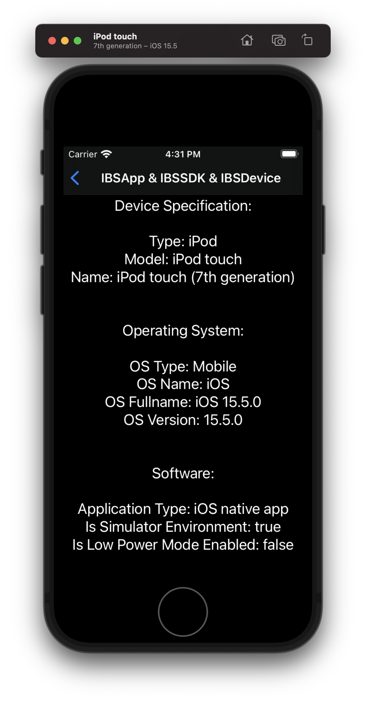
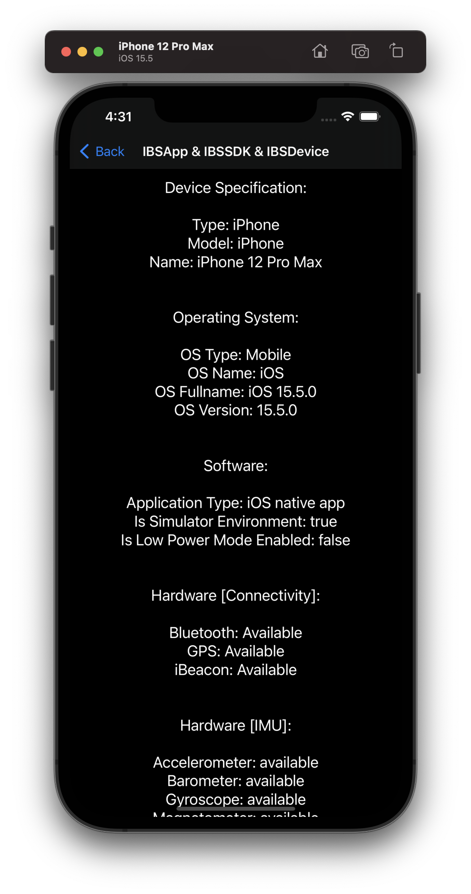
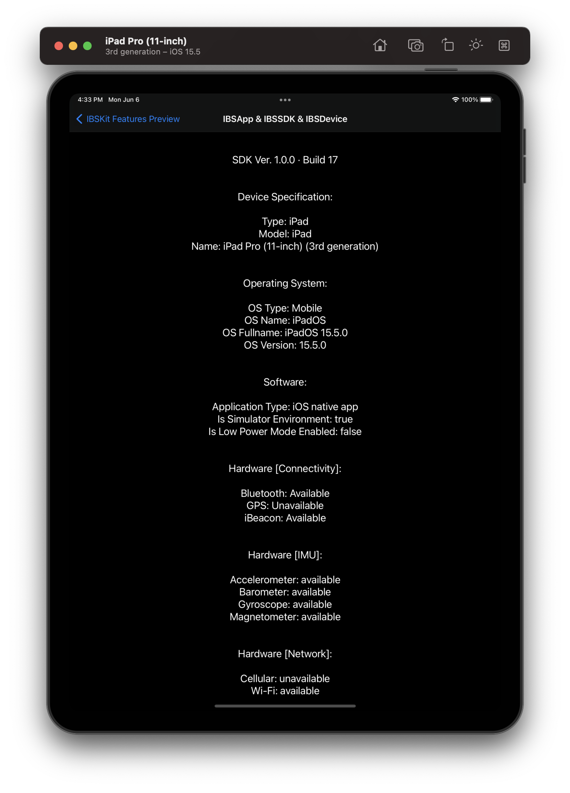
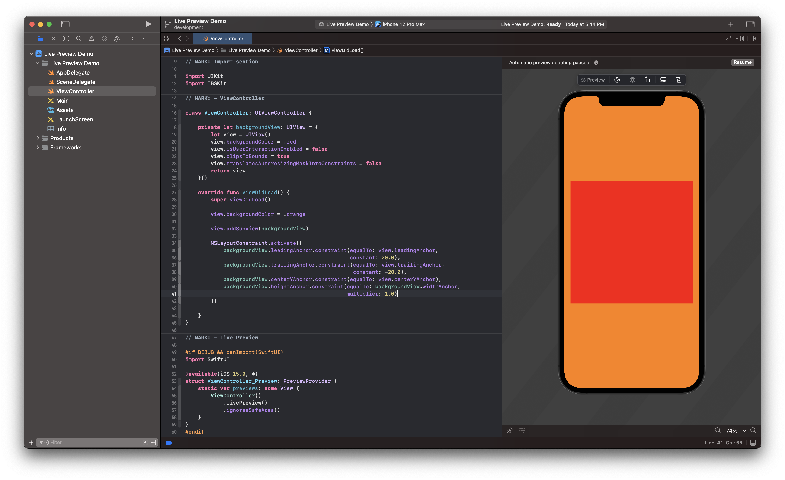
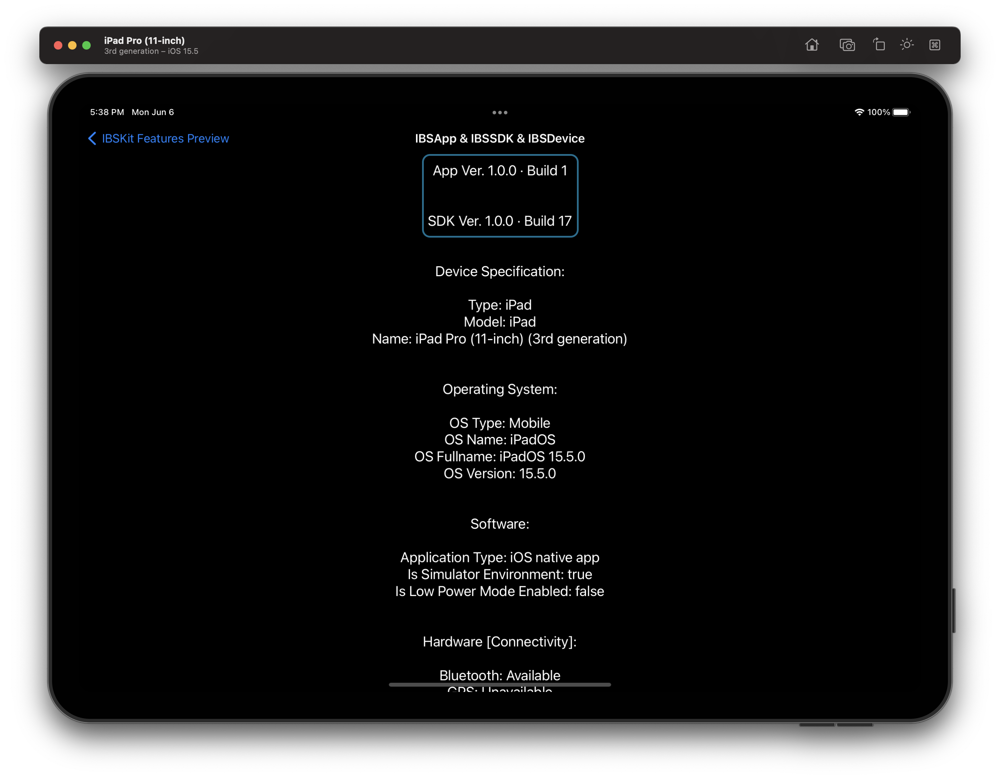
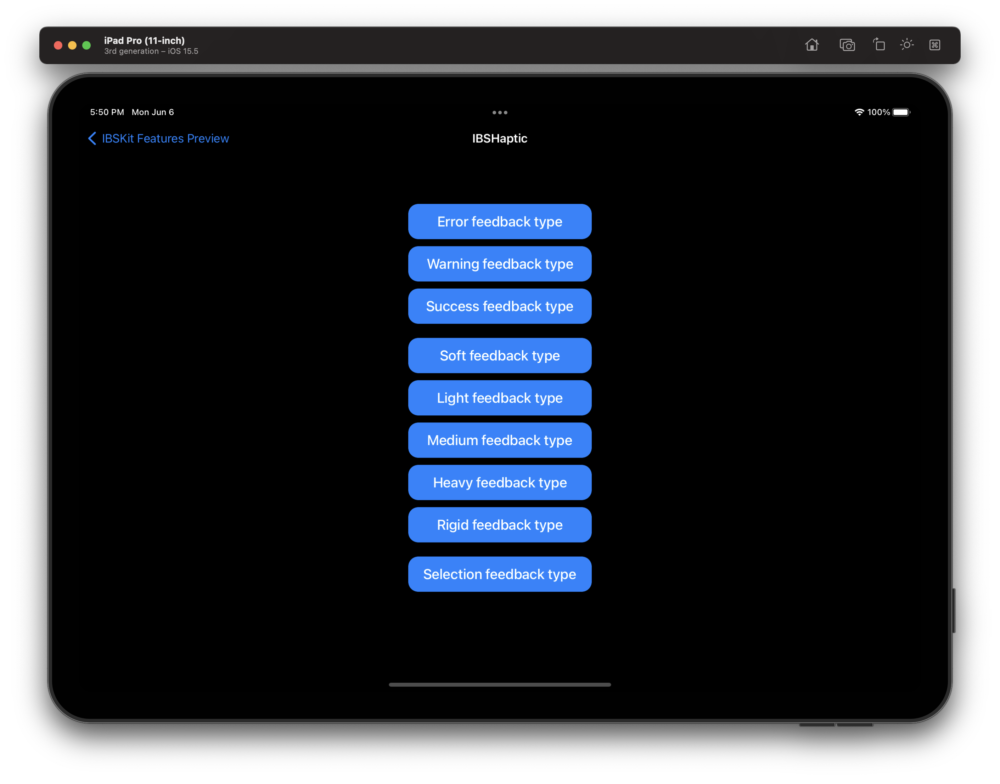

<p align="center"> 
 
</p>

<p align="center">
 <a title="Swift Language" href="https://github.com/apple/swift">
  
 </a>
 <a title="Xcode IDE" href="https://apps.apple.com/ru/app/xcode/id497799835?l=en&mt=12">
  
 </a>
 <a title="iOS">
  
 </a>
</p>

[](https://git.io/typing-svg)

#### IBSKit is an [Xcode Fat Framework](#full-description) written in [Swift 5](https://github.com/apple/swift).

#### `Xcode 13.0+` ﹒ `Swift 5.5+` ﹒ `iOS 13.0+` ﹒ `iPadOS 13.0+`

- - -

## Table of Contents

* **About the framework**
  * [Full description](#full-description)
  * [Used technologies](#used-technologies)
* **How to add a dependency?**
  * [Swift Package Manager](#swift-package-manager)
  * [Another way](#another-way)
* **IBSKit Features Set**
  * [Dev Tools](#dev-tools)
    * [Device Specification](#device-specification)
    * [Live Preview](#live-preview)
    * [Project Specification](#project-specification)
  * [Hardware](#hardware)
    * [Haptic Feedback](#haptic-feedback)
  * [Software](#software)
    * [Split Space Controller](#split-space-controller)
    * [Donut Chart View](#donut-chart-view)
    * [Pie Chart View](#pie-chart-view)
    * [Progress Bar View](#progress-bar-view)
    * [Ring Progress Bar View](#ring-progress-bar-view)
    * [Blur Visual FX View](#blur-visual-fx-view)
    * [Vibrancy Visual FX View](#vibrancy-visual-fx-view)
* **Availability**
  * [Supported devices](#supported-devices)
    * [iPod touch](#ipod-touch)
    * [iPhone](#iphone)
    * [iPad](#ipad)
  * [Supported OS](#supported-os)
    * [iOS](#ios)
    * [iPadOS](#ipados)
* **Other**
  * [Project e-mail](#project-e-mail)
* **License**
  * [IBSKit license](#ibskit-license)

- - -

### About the framework

#### Full description

###### `Xcode Fat Framework`

**Name:** `IBSKit`  

**Environment:**  `Xcode IDE | Xcode CLT`  

**Target Platform:**  `🍏 Platforms`  

**Binary format:** `The framework comes as a binary file, which simplifies the assembly of projects in which it is used, as well as provides support for the necessary set of architectures, both for real devices and for simulators for the Apple and Intel platform`  

**What is it created for?** `The framework is designed to solve everyday tasks that any iOS developer faces when developing a new project. The framework provides a set of features that simplify and accelerate the development of new products based on it`

#### Used technologies


- - -

### How to add a dependency?

###### *The patch version varies depending on the releases with bug fixes and errors.*

#### Swift Package Manager

#### Another way

- - -

### IBSKit Features Set

#### Dev Tools

##### Device Specification

To get information about a device, use the IBSDevice class. For example:

```swift
IBSDevice.current.specification
```

<p align="center"> 
 
 
 
</p>

##### Live Preview

The framework implements Canvas / Hot Reload support for UIKit. In order to use this functionality, you need to add the following code to the end of the file with the successor to UIViewController or UIView:

```swift
// MARK: - Live Preview

#if DEBUG && canImport(SwiftUI)
import SwiftUI

@available(iOS 15.0, *)
struct ClassName_Preview: PreviewProvider {
    static var previews: some View {
        ClassName()
            .livePreview()
    }
}
#endif
```

Where `ClassName` is the name of your UIViewController or UIView class successor. Calling the livePreview() method translates the view of your class into the View protocol view.

<p align="center"> 
 
</p>

##### Project Specification

To get information about the version and build of the application or framework, use:

```swift
IBSApp.info.version
IBSApp.info.build
```
or 

```swift
IBSSDK.info.version
IBSSDK.info.build
```

<p align="center"> 
 
</p>

#### Hardware

##### Haptic Feedback

Allows you to use the  Taptic Engine without using wrappers to reconciliate the device type, and also supports multithreading by default. To implement tactile recoil, it is enough to refer to the `execute(with: IBSHaptic.FeedbackType)` method:

```swift
IBSHaptic.feedback.execute(with: IBSHaptic.FeedbackType)
```

Where `IBSHaptic.FeedbackType` is an enumeration that provides haptic feedback types.

```swift
public enum IBSHaptic.FeedbackType: String, CaseIterable {
    case error = "Error feedback type"
    case warning = "Warning feedback type"
    case success = "Success feedback type"
    case soft = "Soft feedback type"
    case light = "Light feedback type"
    case meduim = "Medium feedback type"
    case heavy = "Heavy feedback type"
    case rigid = "Rigid feedback type"
    case selection = "Selection feedback type"
}
```

<p align="center"> 
 
</p>

#### Software
    
##### Split Space Controller
##### Donut Chart View
##### Pie Chart View
##### Progress Bar View
##### Ring Progress Bar View
##### Blur Visual FX View
##### Vibrancy Visual FX View

- - -

### Availability

#### Supported devices
###### iPod touch
`iPod touch (7th generation)`﹒`or above`
###### iPhone
`iPhone SE (1st generation)`﹒`or above`
###### iPad
`iPad mini (4th generation)`﹒`or above`  
`iPad (5th generation)`﹒`or above`  
`iPad Air (2nd generation)`﹒`or above`  
`iPad Pro 9.7-inch`  
`iPad Pro 10.5-inch`  
`iPad Pro 11-inch (1st generation)`﹒`or above`  
`iPad Pro 12.9-inch (1st generation)`﹒`or above`

#### Supported OS
###### iOS
`iOS 13.0`﹒`and higher`
###### iPadOS
`iPadOS 13.0`﹒`and higher`

- - -

### Other

#### Project e-mail
[apple.dev@ibs.ru](mailto:apple.dev@ibs.ru)

- - -

### License

#### IBSKit license

##### `⚠️: IBSKit ﹒ IBS. 2022. All Rights Reserved.`
